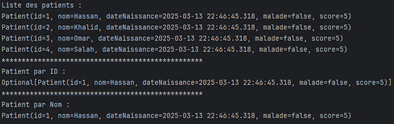
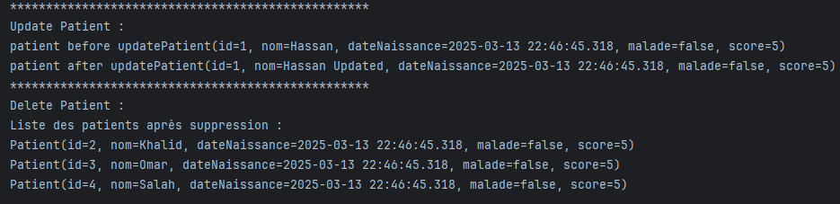

# TP2 - ORM JPA Hibernate Spring Data

## Description du projet
Ce TP couvre la création d'une application Spring Boot utilisant JPA/Hibernate avec une base de données H2 puis MySQL. L'application permet de gérer des patients avec les opérations CRUD de base.

## Étapes du TP

### 1. Création du projet Spring Initializer
Nous avons utilisé Spring Initializer pour créer un projet Spring Boot avec les dépendances suivantes :
- Spring Data JPA
- H2 Database
- Spring Web
- Lombok

### 2. Création de l'entité JPA Patient
Nous avons créé l'entité JPA `Patient` avec les attributs suivants :
```java
@Entity @AllArgsConstructor @NoArgsConstructor @ToString @Getter @Setter
public class Patient {
    @Id @GeneratedValue(strategy = GenerationType.IDENTITY)
    Long id;
    String nom;
    Date dateNaissance;
    Boolean malade;
    int score;

}
```

### 3. Configuration de l'unité de persistance
Nous avons configuré l'unité de persistance dans le fichier `application.properties` :

**Configuration H2:**
```properties
# Configuration pour H2 Database
spring.datasource.url=jdbc:h2:mem:patients
spring.h2.console.enabled=true
```

### 4. Création du Repository
Nous avons créé l'interface `PatientRepository` qui étend `JpaRepository` :
```java
public interface PatientRepository extends JpaRepository<Patient, Long> {
    Patient findByNomContains(String hassan);

}
```

### 5. Test des opérations CRUD

Dans la classe principale de l'application, nous avons testé des opérations sur les patients:

```java
@SpringBootApplication
public class Tp2OrmJpaHibernateSpringDataApplication {

    public static void main(String[] args) {
        SpringApplication.run(Tp2OrmJpaHibernateSpringDataApplication.class, args);
    }
    @Bean
    CommandLineRunner start(PatientRepository patientRepository){
        return args -> {
            Patient p = new Patient(null, "Hassan", new Date(), false, 5);
            Patient p2 = new Patient(null, "Khalid", new Date(), false, 5);
            Patient p3 = new Patient(null, "Omar", new Date(), false, 5);
            Patient p4 = new Patient(null, "Salah", new Date(), false, 5);
            patientRepository.save(p);
            patientRepository.save(p2);
            patientRepository.save(p3);
            patientRepository.save(p4);
            List<Patient> patients = patientRepository.findAll();
            System.out.println("Liste des patients : ");
            for (Patient patient : patients) {
                System.out.println(patient.toString());
            }
            System.out.println("*".repeat(50));
            System.out.println("Patient par ID : ");
            Optional patient = patientRepository.findById(1L);
            System.out.println(patient.toString());
            System.out.println("*".repeat(50));
            System.out.println("Patient par Nom : ");
            Patient patientByNom = patientRepository.findByNomContains("Hassan");
            System.out.println(patientByNom.toString());
            System.out.println("*".repeat(50));
            System.out.println("Update Patient : ");
            Patient patientToUpdate = patientRepository.findById(1L).get();
            System.out.println("patient before update"+patientToUpdate.toString());
            patientToUpdate.setNom("Hassan Updated");
            patientRepository.save(patientToUpdate);

            System.out.println("patient after update"+patientToUpdate.toString());

            System.out.println("*".repeat(50));
            System.out.println("Delete Patient : ");
            patientRepository.deleteById(1L);
            List<Patient> patientsAfterDelete = patientRepository.findAll();
            System.out.println("Liste des patients après suppression : ");
            for (Patient patientAfterDelete : patientsAfterDelete) {
                System.out.println(patientAfterDelete.toString());
            }

        };
    }

}

```

## Résultat des tests
Après avoir exécuté l'application, voici le résultat des tests:




### 6. Migration de H2 vers MySQL
Pour migrer de H2 vers MySQL, nous avons:

1. Ajouté la dépendance MySQL dans `pom.xml`:
```xml
<dependency>
    <groupId>com.mysql</groupId>
    <artifactId>mysql-connector-j</artifactId>
    <scope>runtime</scope>
</dependency>
```

2. Modifié le fichier `application.properties` pour utiliser MySQL:
```properties
# Configuration pour MySQL
spring.datasource.url=jdbc:mysql://localhost:3306/patients?createDatabaseIfNotExist=true
spring.datasource.username=root
spring.datasource.password=root
spring.datasource.driver-class-name=com.mysql.cj.jdbc.Driver
spring.jpa.hibernate.ddl-auto=update


```

## Structure du projet

```
src/
├── main/
│   ├── java/
│   │   └── ma/
│   │       └── proj/
│   │           └── tp2ormjpahibernatespringdata/
│   │               ├── Tp2OrmJpaHibernateSpringDataApplication.java
│   │               ├── entities/
│   │               │   └── Patient.java
│   │               ├── repositories/
│   │               │   └── PatientRepository.java
│   │               
│   └── resources/
│       └── application.properties
```

## Technologies utilisées
- Spring Boot 3.2.x
- Spring Data JPA
- Hibernate ORM
- H2 Database (pour développement)
- MySQL (pour production)
- Lombok

## Conclusion
Ce TP nous a permis de mettre en pratique les concepts fondamentaux de la persistance de données avec Spring Boot, JPA et Hibernate. Nous avons implémenté un CRUD complet pour gérer des patients, en utilisant d'abord H2 comme base de données en mémoire puis en migrant vers MySQL pour un environnement plus proche de la production.